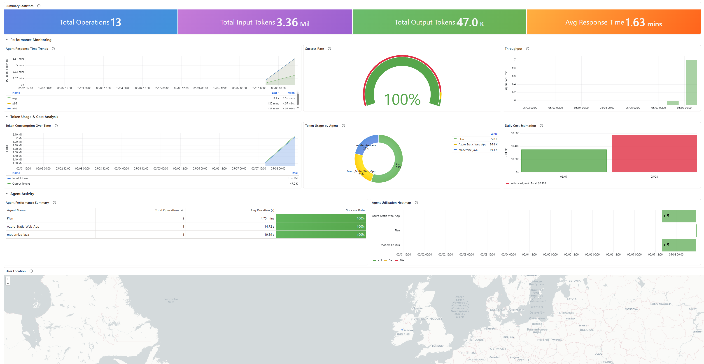

# GitHub Copilot Usage Dashboard

Visualise GitHub Copilot usage across your organisation using OpenTelemetry, Azure Application Insights, and Azure Managed Grafana.



VS Code sends Copilot telemetry (chat sessions, agent invocations, token usage, geographic data) via OTLP to a self-hosted OTel Collector running on Azure Container Apps. The collector forwards the data to Application Insights, where it is queried by a Grafana dashboard.

## Architecture

```
VS Code (GitHub Copilot)
        │  OTLP/HTTP (port 4318)
        ▼
OTel Collector  (Azure Container Apps — public HTTPS endpoint)
        │  Azure Monitor exporter
        ▼
Application Insights (workspace-based)
        │  Azure Monitor data source
        ▼
Azure Managed Grafana
```

## Repository Contents

| File / Folder | Purpose |
|---|---|
| `Dockerfile` | Builds the custom OTel Collector image from `otel/opentelemetry-collector-contrib` |
| `config.yaml` | OTel Collector pipeline config (receivers, processors, Azure Monitor exporter) |
| `grafana-agent-usage-geo.json` | Grafana dashboard JSON — import this into your Managed Grafana instance |
| `KQL-queries.txt` | Sample KQL queries for exploring raw data in Application Insights |
| `terraform/` | Terraform code to provision all required Azure infrastructure |
| `plan.md` | Detailed step-by-step build guide (Terraform path) |
| `manual-setup.md` | CLI-based manual setup using a Storage file share and Key Vault |
| `portal-setup.md` | Step-by-step Azure Portal setup with minimal CLI |

## Quick Start

### 1. Prerequisites

- Azure subscription with **Contributor** rights
- [Azure CLI](https://learn.microsoft.com/en-us/cli/azure/install-azure-cli) — `az login`
- [Terraform](https://developer.hashicorp.com/terraform/install) ≥ 1.5
- [Docker](https://docs.docker.com/get-docker/)
- VS Code with a **GitHub Copilot Business or Enterprise** licence

### 2. Provision Azure infrastructure

```bash
cd terraform
terraform init
terraform plan -out=tfplan
terraform apply tfplan
```

This creates: a resource group, Log Analytics workspace, Application Insights, Key Vault (storing the App Insights connection string as a secret), Container Registry, Container App Environment, OTel Collector Container App (public HTTPS), and Azure Managed Grafana — with all required role assignments.

### 3. Build and push the collector image

```bash
ACR=$(terraform -chdir=terraform output -raw acr_login_server)
az acr login --name "${ACR%%.*}"
docker build -t ${ACR}/otel-collector:latest .
docker push ${ACR}/otel-collector:latest

# Trigger a new Container App revision to pull the image
az containerapp update \
  --name copilot-dash-collector \
  --resource-group copilot-dashboard-rg \
  --image ${ACR}/otel-collector:latest
```

### 4. Configure VS Code

Add the following to your VS Code **User Settings** (`settings.json`), replacing `<fqdn>` with the output of `terraform -chdir=terraform output -raw container_app_fqdn`:

```json
{
  "github.copilot.nextEditSuggestions.enabled": true,
  "github.copilot.chat.otel.enabled": true,
  "github.copilot.chat.otel.exporterType": "otlp-http",
  "github.copilot.chat.otel.otlpEndpoint": "https://<fqdn>"
}
```

Restart VS Code. Telemetry will begin flowing as soon as you use Copilot Chat.

### 5. Import the Grafana dashboard

1. Open the Managed Grafana instance (`terraform -chdir=terraform output -raw grafana_endpoint`)
2. **Connections → Data sources → Add** → **Azure Monitor** → Authentication: **Managed Identity** → **Save & Test**
3. **Dashboards → Import → Upload JSON file** → select `grafana-agent-usage-geo.json`
4. Map the `DS_AZURE_MONITOR` input to the data source just created → **Import**

## Terraform Variables

Override defaults by creating `terraform/terraform.tfvars`:

```hcl
prefix              = "copilot-dash"   # prefix for all resource names
location            = "northeurope"    # Azure region
resource_group_name = "copilot-dashboard-rg"
```

## Troubleshooting

### 1. Test that the Container App is accepting telemetry

Send a minimal OTLP/HTTP request directly to the collector endpoint using `curl`. A `200` or `204` response confirms the Container App is reachable and the receiver is running:

```bash
FQDN=$(terraform -chdir=terraform output -raw container_app_fqdn)

curl -i -X POST "https://${FQDN}/v1/traces" \
  -H "Content-Type: application/json" \
  -d '{
    "resourceSpans": [{
      "resource": { "attributes": [] },
      "scopeSpans": [{
        "scope": { "name": "test" },
        "spans": [{
          "traceId": "00000000000000000000000000000001",
          "spanId": "0000000000000001",
          "name": "test-span",
          "kind": 1,
          "startTimeUnixNano": "1700000000000000000",
          "endTimeUnixNano":   "1700000001000000000",
          "status": {}
        }]
      }]
    }]
  }'
```

Expected response: `HTTP/2 200` with an empty `{}` body.

If you get a connection error or `404`, check:
- The Container App revision is running: **Azure Portal → Container App → Revisions**
- The image has been pushed and the app updated (Step 3 of Quick Start)
- Ingress is enabled and `target_port` is `4318`: **Container App → Ingress**

To inspect live logs from the collector:

```bash
az containerapp logs show \
  --name copilot-dash-collector \
  --resource-group copilot-dashboard-rg \
  --follow
```

Look for lines containing `POST /v1/traces` (access log) or `Traces` / `ScopeSpans` (debug exporter output).

---

### 2. Verify the collector is pushing data into Application Insights

**Check the collector logs for export errors:**

```bash
az containerapp logs show \
  --name copilot-dash-collector \
  --resource-group copilot-dashboard-rg \
  --follow
```

A successful export looks like:

```
TracesExporter  {"kind": "exporter", "data_type": "traces", "name": "azuremonitor", "resource spans": 1, ...}
```

Errors such as `Exporting failed` or `connection refused` indicate the `APPLICATIONINSIGHTS_CONNECTION_STRING` environment variable is missing or incorrect. Verify it is set on the Container App:

```bash
az containerapp show \
  --name copilot-dash-collector \
  --resource-group copilot-dashboard-rg \
  --query "properties.template.containers[0].env"
```

**Query Application Insights directly:**

Open Application Insights in the Azure Portal → **Logs** and run:

```kusto
dependencies
| where timestamp > ago(1h)
| take 20
```

If rows appear, data is flowing end-to-end. If the table is empty after sending a test span (above), allow 2–3 minutes for ingestion lag and retry. If still empty, confirm the connection string in the environment variable matches the one shown in **Application Insights → Overview → Connection String**.

---

## Tear Down

```bash
terraform -chdir=terraform destroy
```

## Detailed Guides

| Guide | Description |
|---|---|
| [plan.md](plan.md) | Full Terraform-based walkthrough including resource descriptions, verification steps, and security notes |
| [manual-setup.md](manual-setup.md) | Step-by-step Azure Portal / CLI setup using a Storage file share mount for `config.yaml`, Key Vault for the connection string, and Managed Grafana dashboard import |
| [portal-setup.md](portal-setup.md) | Same setup using the Azure Portal as much as possible — minimal CLI, step-by-step UI instructions for every resource |
